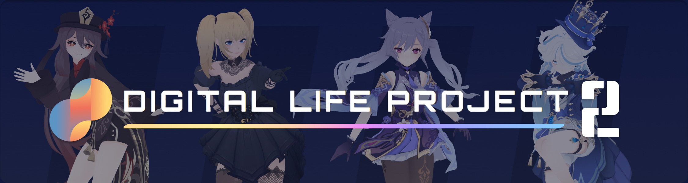
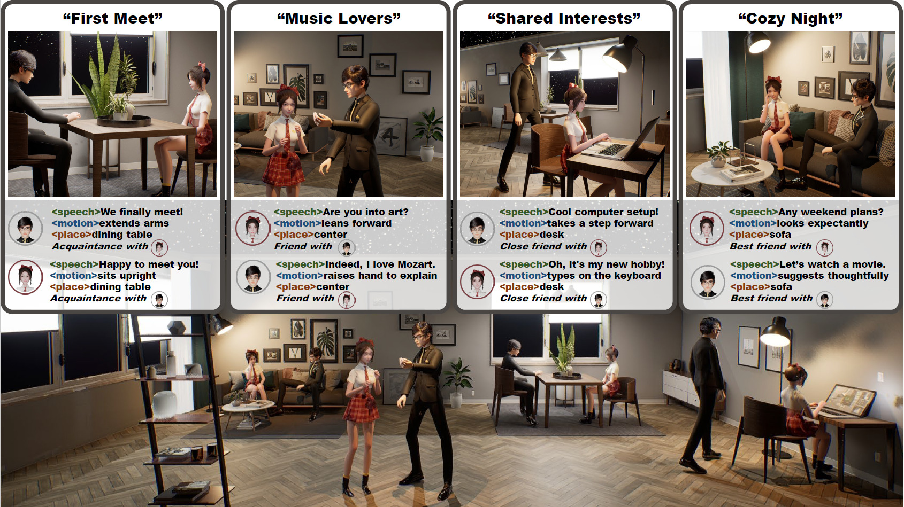

# Digital Life Project Series

Digital Life Project (DLP) is a research series bridging AI and 3D virtual embodiment, evolving from Digital Life Project (CVPR 2024) to Digital Life Project 2 (SIGGRAPH Asia 2025 Real-Time Live!). This organization hosts the fully open-source code and assets for [Digital Life Project 2 (DLP3D)](https://github.com/dlp3d-ai/dlp3d.ai).


# Digital Life Project 2 (2025)

<div align="center">
    
</div>

<br/>

<div align="center">

**SIGGRAPH Asia 2025 (Real-Time Live!), Hong Kong**

</div>

<p align="center">
  <a href="https://dlp3d.ai/"></a>
  <a href="https://www.youtube.com/watch?v=cNEMW6IHKl8"></a>
  <a href="https://x.com/dlp3d_ai"></a>
  <a href="https://www.xiaohongshu.com/user/profile/678df66a000000000d008dd1"></a>
  <a href="https://discord.gg/XYXuBn9R8c"></a>
  <a href="https://deepwiki.com/dlp3d-ai/dlp3d.ai"></a>
  <a href="https://dlp3d.readthedocs.io/en/latest/index.html"></a>
  <a href="https://dlp3d.readthedocs.io/zh-cn/latest/"></a>
  <a href="https://github.com/dlp3d-ai/dlp3d.ai/blob/main/LICENSE"></a>
</p>


## Overview

Digital Life Project 2 (DLP3D) is an open-source real-time framework that brings Large Language Models (LLMs) to life through expressive 3D avatars. Users converse naturally by voice, while characters respond on demand with unified audio, whole-body animation, and physics simulation directly in the browser. Characters are fully customizable in both appearance (3D models) and personality (character prompts) and readily adaptable to any LLM or text-to-speech (TTS) service. 
<div align="center">
    
</div>


## Content

This organization contains the following key repositories:

- **[dlp3d.ai](https://github.com/dlp3d-ai/dlp3d.ai): the main entry point, start here!**
- [orchestrator](https://github.com/dlp3d-ai/orchestrator): coordinates and synchronizes all components.
- [web_backend](https://github.com/dlp3d-ai/web_backend): manages the backend web services.
- [speech2motion](https://github.com/dlp3d-ai/speech2motion): converts speech into body animation.
- [audio2face](https://github.com/dlp3d-ai/audio2face): generates facial animation from audio.
- [MotionDataViewer](https://github.com/dlp3d-ai/MotionDataViewer): visualizes and inspects motion data.


## Get Started

- Option 1: Check out **[Quick Start](https://dlp3d.readthedocs.io/en/latest/getting_started/quick_start.html)** to deploy your own DLP3D locally! You’ll need to provide your own API keys, but you’ll have complete freedom to modify, extend, and integrate the system into anything you like.

- Option 2: Visit **[https://dlp3d.ai](https://dlp3d.ai/)** to to enjoy a ready-to-play hosted service — entirely free, including complimentary API access to selected providers (recommended for users in mainland China for the smoothest experience)! 


## Citations
If you use this project in your research, please cite:
```
@inproceedings{dlp3d,
    author    = {Cai, Zhongang and Ren, Daxuan and Gao, Yang and Wei, Yukun and Zhou, Tongxi and Lin, Zhengyu and Jang, Huimuk and Zeng, Haoyang and Loy, Chen Change and Liu, Ziwei and Yang, Lei},
    title     = {Digital Life Project 2: Open-source Autonomous 3D Characters on the Web},
    booktitle = {SIGGRAPH Asia 2025 Real-Time Live!},
    year      = {2025},
    pages     = {3},
    isbn      = {9798400721359},
    publisher = {Association for Computing Machinery},
    address   = {New York, NY, USA},
    url       = {https://doi.org/10.1145/3757375.3774342},
    doi       = {10.1145/3757375.3774342},
    abstract  = {Digital Life Project 2 (DLP2) presents an open-source real-time framework that brings Large Language Models (LLMs) to life through expressive 3D avatars. Users converse naturally by voice, while characters respond on demand with unified audio, whole-body animation, and physics simulation directly in the browser. At its core are: (1) an agentic orchestration of large and small LLMs that governs character behavior, supported by a memory system tracking emotional states and evolving relationships to enable context-dependent reactions; (2) a hybrid real-time pipeline that segments long LLM responses, performs parallel motion retrieval and audio-motion synchronization, and streams efficiently through a custom Protocol Buffers structure for low-latency playback of voice, motion, and expression; and (3) robust mechanisms for user interruption handling, adaptive buffering, and fault tolerance. Characters are fully customizable in both appearance (3D models) and personality (character prompts) and readily adaptable to any LLM or text-to-speech (TTS) service. DLP2 demonstrates how LLMs can be embodied in responsive 3D characters, offering a practical blueprint for real-time, emotionally adaptive digital interactions on the web.},
    articleno = {3},
    numpages  = {2},
    location  = {Hong Kong Convention and Exhibition Centre, Hong Kong, Hong Kong},
    series    = {SA '25}
}
```


# Digital Life Project (2024)

<div align="center">
    
</div>

<br/>

<div align="center">

**CVPR 2024, Seattle**

</div>

The original Digital Life Project (DLP) introduces a framework utilizing language as the universal medium to build autonomous 3D characters, who are capable of engaging in social interactions and expressing with articulated body motions, thereby simulating life in a digital environment. This experimental work established the theoretical foundation for Digital Life Project 2 (DLP3D). For more information, visit the [project homepage](https://digital-life-project.com/).

## Citation
```
@InProceedings{dlp,
    author    = {Cai, Zhongang and Jiang, Jianping and Qing, Zhongfei and Guo, Xinying and Zhang, Mingyuan and Lin, Zhengyu and Mei, Haiyi and Wei, Chen and Wang, Ruisi and Yin, Wanqi and Pan, Liang and Fan, Xiangyu and Du, Han and Gao, Peng and Yang, Zhitao and Gao, Yang and Li, Jiaqi and Ren, Tianxiang and Wei, Yukun and Wang, Xiaogang and Loy, Chen Change and Yang, Lei and Liu, Ziwei},
    title     = {Digital Life Project: Autonomous 3D Characters with Social Intelligence},
    booktitle = {Proceedings of the IEEE/CVF Conference on Computer Vision and Pattern Recognition (CVPR)},
    month     = {June},
    year      = {2024},
    pages     = {582-592}
}
```
