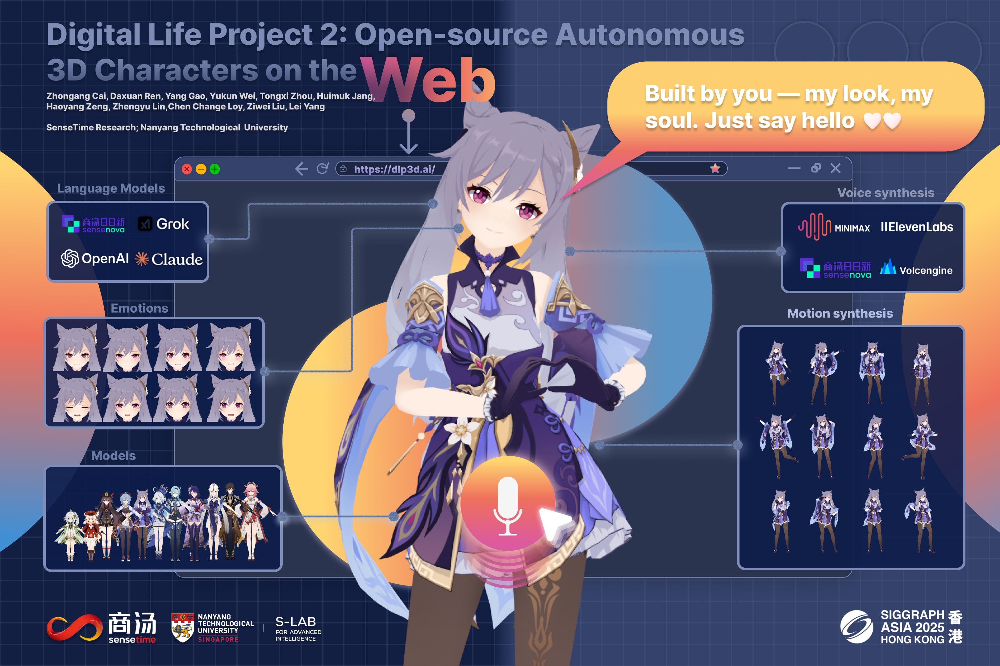

# Overview

Digital Life Project (DLP) is a research series bridging AI and 3D virtual embodiment,evolving from Digital Life Project (CVPR 2024) to Digital Life Project 2 (SIGGRAPH Asia 2025 Real-Time Live!). This organization hosts the fully open-source code and assets for [Digital Life Project 2 (DLP3D)](https://github.com/dlp3d-ai/dlp3d.ai).


# Digital Life Project 2 (2025)

Digital Life Project 2 (DLP3D) is an open-source real-time framework that brings Large Language Models (LLMs) to life through expressive 3D avatars. Users converse naturally by voice, while characters respond on demand with unified audio, whole-body animation, and physics simulation directly in the browser. Characters are fully customizable in both appearance (3D models) and personality (character prompts) and readily adaptable to any LLM or text-to-speech (TTS) service. 
<div align="center">
    
</div>


## Content

This organization contains the following key repositories:

- **[dlp3d.ai](https://github.com/dlp3d-ai/dlp3d.ai): the main entry point, start here!**
- [orchestrator](https://github.com/dlp3d-ai/orchestrator): coordinates and synchronizes all components.
- [web_backend](https://github.com/dlp3d-ai/web_backend): manages the backend web services.
- [speech2motion](https://github.com/dlp3d-ai/speech2motion): converts speech into body animation.
- [audio2face](https://github.com/dlp3d-ai/audio2face): generates facial animation from audio.
- [MotionDataViewer](https://github.com/dlp3d-ai/MotionDataViewer): visualizes and inspects motion data.


## Citations
If you use this project in your research, please cite:
```
@misc{dlp3d.ai,
    author       = {Cai, Zhongang and Ren, Daxuan and Gao, Yang and Wei, Yukun and Zhou, Tongxi and Jang, Huimuk and Zeng, Haoyang and Lin, Zhengyu and Loy, Chen Change and Liu, Ziwei and Yang, Lei},
    title        = {Digital Life Project 2: Open-source Autonomous 3D Characters on the Web},
    howpublished = {SIGGRAPH Asia 2025 Real-Time Live!},
    year         = {2025},
    note         = {Live demonstration, Hong Kong, China}
    year={2025}
}
```


# Digital Life Project (2024)

The original Digital Life Project (DLP) introduces a framework utilizing language as the universal medium to build autonomous 3D characters, who are capable of engaging in social interactions and expressing with articulated body motions, thereby simulating life in a digital environment. This experimental work established the theoretical foundation for Digital Life Project 2 (DLP3D). For more information, visit the [project homepage](https://digital-life-project.com/).

<div align="center">
    
</div>


## Citation
```
@InProceedings{dlp,
    author    = {Cai, Zhongang and Jiang, Jianping and Qing, Zhongfei and Guo, Xinying and Zhang, Mingyuan and Lin, Zhengyu and Mei, Haiyi and Wei, Chen and Wang, Ruisi and Yin, Wanqi and Pan, Liang and Fan, Xiangyu and Du, Han and Gao, Peng and Yang, Zhitao and Gao, Yang and Li, Jiaqi and Ren, Tianxiang and Wei, Yukun and Wang, Xiaogang and Loy, Chen Change and Yang, Lei and Liu, Ziwei},
    title     = {Digital Life Project: Autonomous 3D Characters with Social Intelligence},
    booktitle = {Proceedings of the IEEE/CVF Conference on Computer Vision and Pattern Recognition (CVPR)},
    month     = {June},
    year      = {2024},
    pages     = {582-592}
}
```
